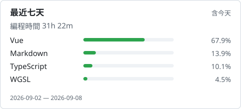
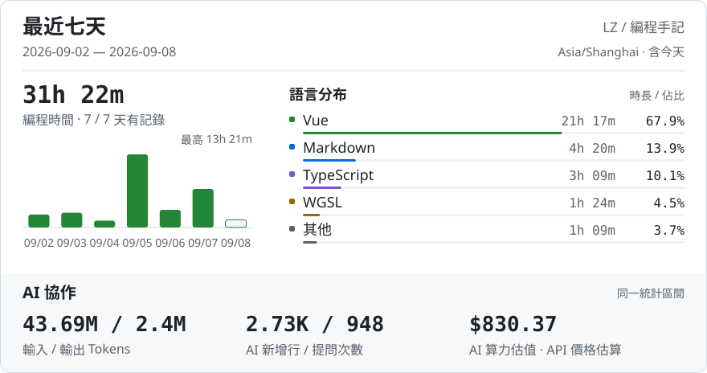

# Hi, I'm LZ 👋

會一點網路，一點伺服器，也在學著把前端寫好。 
喜歡折騰小工具，讓有趣的想法變成能用的東西。

[個人網站 ↗](https://longmiao.org) · [我的專案 ↗](https://github.com/LZSMIAO?tab=repositories)

<picture>
  <source media="(prefers-color-scheme: dark)" srcset="assets/coding-dark-a3c882b232c0.svg">
  
</picture>

展開編程週報 · 每日趨勢、語言時長與 AI 協作

<picture>
  <source media="(max-width: 600px) and (prefers-color-scheme: dark)" srcset="assets/report-dark-mobile-efd53cb7460a.svg">
  <source media="(max-width: 600px)" srcset="assets/report-light-mobile-8b4791601bb4.svg">
  <source media="(prefers-color-scheme: dark)" srcset="assets/report-dark-dbaeeb693008.svg">
  
</picture>

最近公開動態

<!-- ACTIVITY:START -->
暫無可展示的公開動態，之後會自動更新。
<!-- ACTIVITY:END -->

<picture>
  <source media="(prefers-color-scheme: dark)" srcset="https://raw.githubusercontent.com/LZSMIAO/LZSMIAO/output/github-snake-playful-dark.svg">
  <source media="(prefers-color-scheme: light)" srcset="https://raw.githubusercontent.com/LZSMIAO/LZSMIAO/output/github-snake-playful.svg">
  
</picture>
