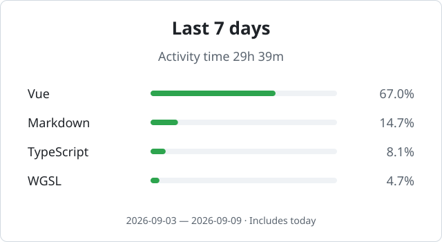

<h1 align="center">Hi, I'm lzsm 👋</h1>

  <em>Me? Nobody.</em> 
  Building ideas with a little help from ChatGPT and Claude.

  

  <picture>
    <source media="(max-width: 600px) and (prefers-color-scheme: dark)" srcset="assets/coding-dark-mobile-88fde9615002.svg">
    <source media="(max-width: 600px)" srcset="assets/coding-light-mobile-c73cee545b3e.svg">
    <source media="(prefers-color-scheme: dark)" srcset="assets/coding-dark-e2c99928827c.svg">
    
  </picture>

 

  
<strong>Weekly Report</strong>

   

  

    <picture>
      <source media="(max-width: 600px) and (prefers-color-scheme: dark)" srcset="assets/report-dark-mobile-2b1e5f3f75d1.svg">
      <source media="(max-width: 600px)" srcset="assets/report-light-mobile-7a6bd5c3798c.svg">
      <source media="(prefers-color-scheme: dark)" srcset="assets/report-dark-e3a0ab40ca00.svg">
      
    </picture>
  

 

  
<strong>Recent Activity</strong>

   

  <!-- ACTIVITY:START -->
- 2026-09-09 · Updated project [LZSMIAO/2fa-hot](https://github.com/LZSMIAO/2fa-hot)
<!-- ACTIVITY:END -->

 

  <picture>
    <source media="(prefers-color-scheme: dark)" srcset="https://raw.githubusercontent.com/LZSMIAO/LZSMIAO/output/github-contribution-grid-snake-dark.svg">
    <source media="(prefers-color-scheme: light)" srcset="https://raw.githubusercontent.com/LZSMIAO/LZSMIAO/output/github-contribution-grid-snake.svg">
    
  </picture>

 

<h2 align="center">Featured Projects</h2>

<table align="center">
  <tr>
    <td width="50%" valign="top">
      <h3><a href="https://github.com/LZSMIAO/2fa-hot">2fa.hot</a></h3>
      
Private-by-default TOTP authenticator with QR import, encrypted local history, and 30 languages.

    </td>
    <td width="50%" valign="top">
      <h3><a href="https://github.com/LZSMIAO/home-lzsm">home-lzsm</a></h3>
      
A clean personal homepage and experiment space built with Vue.

    </td>
  </tr>
</table>

 

<h2 align="center">Now Playing</h2>

  

 

  <a href="https://longmiao.org">Website</a> ·
  <a href="mailto:lzsm@proton.me">Email</a> ·
  <a href="https://x.com/lzsmtw">X</a> ·
  <a href="https://t.me/lzsmi">Telegram</a> ·
  <a href="https://www.threads.com/@lzsmiao">Threads</a>

