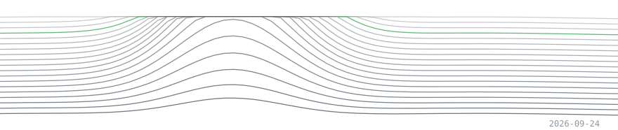
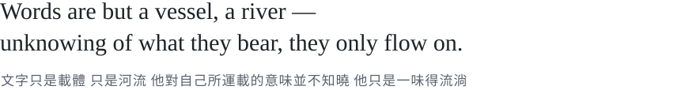
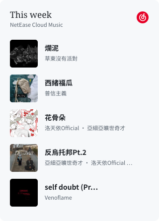
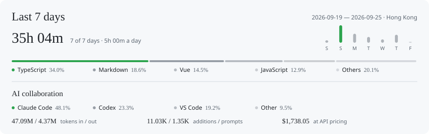
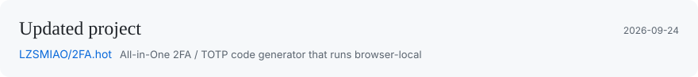
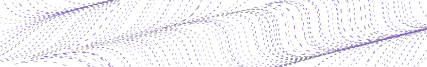
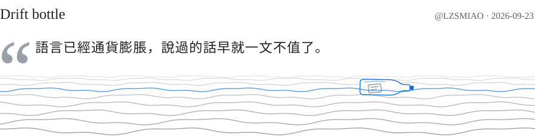

  <picture>
    <source media="(max-width: 600px) and (prefers-color-scheme: dark)" srcset="assets/art-dark-mobile-9da6c1d43005.svg">
    <source media="(max-width: 600px)" srcset="assets/art-light-mobile-47b463ae5e17.svg">
    <source media="(prefers-color-scheme: dark)" srcset="assets/art-dark-a1098235f1c8.svg">
    
  </picture>

  <picture>
    <source media="(max-width: 600px) and (prefers-color-scheme: dark)" srcset="assets/tagline-dark-mobile-d5d20b95f370.svg">
    <source media="(max-width: 600px)" srcset="assets/tagline-light-mobile-3250bb92b61b.svg">
    <source media="(prefers-color-scheme: dark)" srcset="assets/tagline-dark-1fc1beafe600.svg">
    
  </picture>

  
  
  
  

 

 

  <picture>
    <source media="(max-width: 600px) and (prefers-color-scheme: dark)" srcset="assets/report-dark-mobile-b18ad9ea9b35.svg">
    <source media="(max-width: 600px)" srcset="assets/report-light-mobile-2ec650be0fd9.svg">
    <source media="(prefers-color-scheme: dark)" srcset="assets/report-dark-883b7668dc66.svg">
    
  </picture>

 

<!-- ACTIVITY:START -->
<a href="https://github.com/LZSMIAO/2FA.hot"><picture><source media="(max-width: 600px) and (prefers-color-scheme: dark)" srcset="assets/activity-baabd4c17b21.svg"><source media="(max-width: 600px)" srcset="assets/activity-0915034ca244.svg"><source media="(prefers-color-scheme: dark)" srcset="assets/activity-a3d47d76ca7a.svg"></picture></a>
<!-- ACTIVITY:END -->

 

  <picture>
    <source media="(prefers-color-scheme: dark)" srcset="https://raw.githubusercontent.com/LZSMIAO/LZSMIAO/output/github-contribution-grid-snake-dark.svg">
    <source media="(prefers-color-scheme: light)" srcset="https://raw.githubusercontent.com/LZSMIAO/LZSMIAO/output/github-contribution-grid-snake.svg">
    
  </picture>

 

<picture><source media="(max-width: 600px) and (prefers-color-scheme: dark)" srcset="assets/note-title-dark-mobile-c7004ba66af2.svg"><source media="(max-width: 600px)" srcset="assets/note-title-light-mobile-f94abe2cd109.svg"><source media="(prefers-color-scheme: dark)" srcset="assets/note-title-dark-eed9d51d5895.svg"></picture>

 

<strong>我為何放弃一切開始 Vibe Coding</strong>

　　…大概是 2021 年，第四次工業革命，人類進入 AI 時代。由此，我經常看到有人在濫用它，甚至專業程序員也幹這種勾當——只用五分鐘，就生成一個他媽的漸變、不對齊、用100個不同設計風格 UI、塞1000種元素的前端。只用 AI 隨便做個粗製濫造的垃圾系統，就能賣貨給灰產用戶發大財。…這一切看得我噁心，我從床上爬起來，吐了一遍又一遍，可惜未被它們穩穩接住。

　　我想要做的，有錢人都做過了。我做過的、在做的、未來想做的東西，也許別人早已玩膩。有時，一個念頭讓我整夜睡不著，後來才發現，它早有了名字、有了價格，甚至已停止維護。像走了很遠，終於找到一扇通往鄰居家的門。我站在那裡，連來意都顯得多餘。但是我走的時間實在過了太久，久到我都有點不確定自己究竟在做什麼。正如我和同事做的項目，我們為它們傾注太多。渴望早日上線，以換取經濟回報，可還是止不住一遍遍修訂，直到符合我們的要求，直到它被忘記。我也分不清，是還想把它做好，還是不捨得讓它就這樣做完。只記得那些凌晨，窗外已經沒什麼聲音了，我還會因為某個地方終於可行，而感到喜悅。這感覺像是回到九年前，打開 Premiere Pro，全身心投入創作，充滿動力，樂此不疲。但我仍害怕未來不會到來，如同歷史一樣，在某天就結束了。而如今我也再做不出影片了。令人感嘆。

　　我想要說的，前人們都說過了。我不反對 AI。九年前，我是文科生，我可能連他媽怎麼開個網站都不知道。而現在，我卻可以靠它，把原本只存在於腦子裡的東西一點點做出來。所以我希望，某些人能真正善用 AI。它能幫你做事，但不能成為你，永遠。別用它代替你的想法，代替你的判斷，最後甚至代替你的人生。因為當所有人都能用差不多的工具、差不多的模型、差不多的提示詞，把東西「做出來」之後，真正還能留下區別的，可能就只剩下你自己。

　　我想要的公平，都是不公們虛構的。我知道，我改變不了當今快節奏的生活，也攔不住那些東西。它們會繼續出現，繼續被製造，然後靠它賺到我可能幾個月都賺不到的錢。我以前總覺得，好的東西應該得到更多，粗製濫造的東西終究會被淘汰。但世界不公平，它不會因為多改一個像素、多熬了幾個晚上，就多獎勵你一些；也不會因為他隨手拼出一坨垃圾，就禁止他賺錢。我知道我改變不了這些，也攔不住它們。\
所以後來，我也踩上了那些造好的輪子上。

　　那麼 Vibe Coding，如果我也嘗試一下呢？當所有人踩上同樣的輪子，我的NFT，還能否有所不同？我相信，也希望，未來你們會喜歡上某些產品，雖然你不會知道它來自我——那個九年之前，十年之後將跌入互聯網的人。

  <picture>
    <source media="(max-width: 600px) and (prefers-color-scheme: dark)" srcset="assets/flow-dark-mobile-7699a25c18cc.svg">
    <source media="(max-width: 600px)" srcset="assets/flow-light-mobile-06fef0853e22.svg">
    <source media="(prefers-color-scheme: dark)" srcset="assets/flow-dark-e5c0be310778.svg">
    
  </picture>

 

<!-- BOTTLE:START -->
<a href="https://github.com/LZSMIAO/LZSMIAO/issues/14"><picture><source media="(max-width: 600px) and (prefers-color-scheme: dark)" srcset="assets/bottle-b9fd01fd4462.svg"><source media="(max-width: 600px)" srcset="assets/bottle-a85ca0754b68.svg"><source media="(prefers-color-scheme: dark)" srcset="assets/bottle-add9332395c9.svg"></picture></a>
<!-- BOTTLE:END -->
 <a href="https://github.com/LZSMIAO/LZSMIAO/issues/new?template=bottle.yml">Message in a bottle</a>

