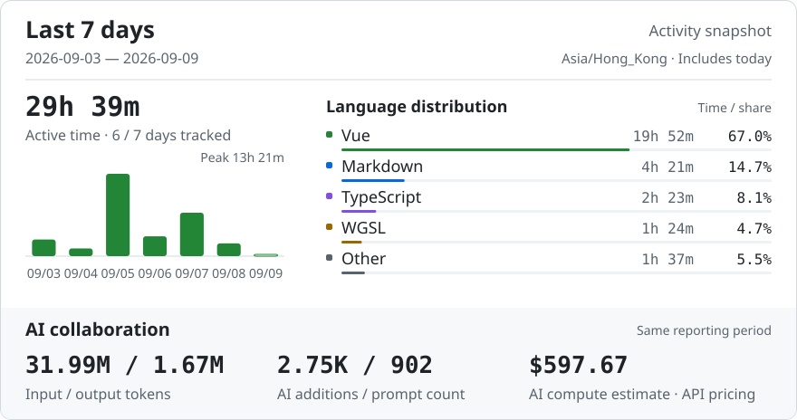

<h2 align="left">Small tools. Big curiosity.</h2>

<p align="left">
  <em>Me? Nobody.</em><br>
  Building ideas with a little help from ChatGPT Cloud.
</p>

<p align="left">
  <a href="mailto:lzsm@proton.me"></a>
  <a href="https://t.me/lzsmi"></a>
  <a href="https://x.com/lzsmtw"></a>
  <a href="https://www.threads.com/@lzsmiao"></a>
</p>

```text
📊 Last 7 days

🕑︎ Time Zone: Asia/Hong Kong

💬 Programming Languages:
Vue              19 hrs 52 mins   █████████████████░░░░░░░░  67.0%
Markdown          4 hrs 22 mins   ████░░░░░░░░░░░░░░░░░░░░  14.7%
TypeScript        2 hrs 24 mins   ██░░░░░░░░░░░░░░░░░░░░░░   8.1%
WGSL              1 hr 24 mins    █░░░░░░░░░░░░░░░░░░░░░░░   4.7%
Other             1 hr 37 mins    █░░░░░░░░░░░░░░░░░░░░░░░   5.5%

Activity time: 29h 39m
```

<br>

<details open>
  <summary><strong>Weekly Report</strong></summary>

  <br>

  <p align="center">
    <picture>
      <source media="(max-width: 600px) and (prefers-color-scheme: dark)" srcset="assets/report-dark-mobile-2b1e5f3f75d1.svg">
      <source media="(max-width: 600px)" srcset="assets/report-light-mobile-7a6bd5c3798c.svg">
      <source media="(prefers-color-scheme: dark)" srcset="assets/report-dark-e3a0ab40ca00.svg">
      
    </picture>
  </p>
</details>

<br>

<details open>
  <summary><strong>Recent Activity</strong></summary>

  <br>

  <table width="100%">
    <tr>
      <td width="56" align="center">🛠️</td>
      <td><strong>Updated project</strong> · <a href="https://github.com/LZSMIAO/2fa-hot">LZSMIAO/2fa-hot</a></td>
      <td align="right"><sub>2026-09-09</sub></td>
    </tr>
  </table>
</details>

<br>


<table align="center" width="100%">
  <tr>
    <td width="50%" align="center" valign="top">
      <h3>Spotify</h3>
      <a href="https://open.spotify.com/user/31undvuuo3zgy4suzqjqujerwfdm">
        
      </a>
    </td>
    <td width="50%" align="center" valign="top">
      <h3>NetEase Cloud Music</h3>
      <a href="https://music.163.com/#/user/home?id=3696535313">
        
      </a>
    </td>
  </tr>
</table>


<p align="center">
  <picture>
    <source media="(prefers-color-scheme: dark)" srcset="https://raw.githubusercontent.com/LZSMIAO/LZSMIAO/output/github-contribution-grid-snake-dark.svg">
    <source media="(prefers-color-scheme: light)" srcset="https://raw.githubusercontent.com/LZSMIAO/LZSMIAO/output/github-contribution-grid-snake.svg">
    
  </picture>
</p>

<hr>
