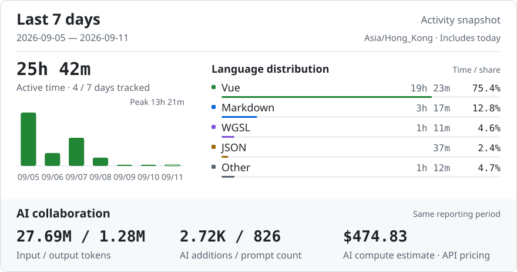
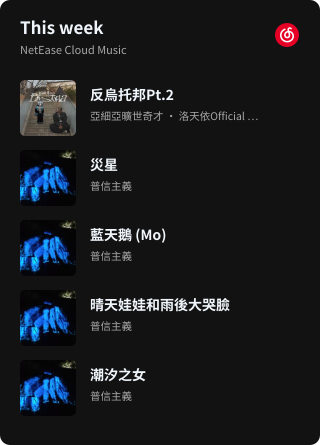

<h2 align="left">Finally, less can be more.</h2>

  <em>Me? Nobody.</em> 
  Building ideas with ChatGPT & Claude

  
  
  
  

~~~text
📊 Last 7 days

🕑 Time Zone: Asia/Hong Kong

2026-09-05 — 2026-09-11

💬 Programming Languages:
Vue                     19h 23m  ███████████████████░░░░░░  75.4%
Markdown                 3h 17m  ███░░░░░░░░░░░░░░░░░░░░░░  12.8%
WGSL                     1h 11m  █░░░░░░░░░░░░░░░░░░░░░░░░   4.6%
JSON                        37m  █░░░░░░░░░░░░░░░░░░░░░░░░   2.4%
Other                    1h 12m  █░░░░░░░░░░░░░░░░░░░░░░░░   4.7%

Activity time: 25h 42m
~~~

 

  
<strong>Weekly Report</strong>

   

  

    <picture>
      <source media="(max-width: 600px) and (prefers-color-scheme: dark)" srcset="assets/report-dark-mobile-567cb3282310.svg">
      <source media="(max-width: 600px)" srcset="assets/report-light-mobile-9cbd5c25d31d.svg">
      <source media="(prefers-color-scheme: dark)" srcset="assets/report-dark-5f4bebe11ff1.svg">
      
    </picture>
  

 

  
<strong>Recent Activity</strong>

   

  <!-- ACTIVITY:START -->
<pre>🛠️  <strong>Updated project</strong> · <a href="https://github.com/LZSMIAO/2fa-hot">LZSMIAO/2fa-hot</a>                                  2026-09-09</pre>
<!-- ACTIVITY:END -->

 

<strong>Song links</strong>

 

<table>
<thead><tr><th align="left">Track</th><th align="left">Artist</th></tr></thead>
<tbody>
<tr><td><a href="https://music.163.com/song?id=3330630999">反烏托邦Pt.2</a></td><td>亞細亞曠世奇才 · 洛天依Official · 烏托邦P</td></tr>
<tr><td><a href="https://music.163.com/song?id=2664295379">災星</a></td><td>普信主義</td></tr>
<tr><td><a href="https://music.163.com/song?id=2746375815">藍天鵝 (Mo)</a></td><td>普信主義</td></tr>
<tr><td><a href="https://music.163.com/song?id=2657736998">晴天娃娃和雨後大哭臉</a></td><td>普信主義</td></tr>
<tr><td><a href="https://music.163.com/song?id=2652725695">潮汐之女</a></td><td>普信主義</td></tr>
</tbody>
</table>

  <picture>
    <source media="(prefers-color-scheme: dark)" srcset="https://raw.githubusercontent.com/LZSMIAO/LZSMIAO/output/github-contribution-grid-snake-dark.svg">
    <source media="(prefers-color-scheme: light)" srcset="https://raw.githubusercontent.com/LZSMIAO/LZSMIAO/output/github-contribution-grid-snake.svg">
    
  </picture>

