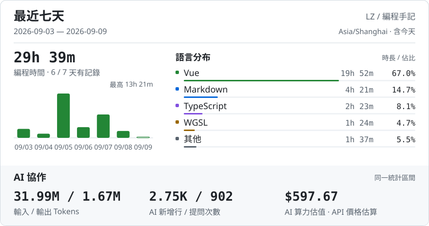

<h1 align="center">Hi, I'm lzsm 👋</h1>

  <em>Me? Nobody.</em> 
  Building ideas with a little help from ChatGPT and Claude.

  

  <picture>
    <source media="(max-width: 600px) and (prefers-color-scheme: dark)" srcset="assets/coding-dark-mobile-70d85c5cc297.svg">
    <source media="(max-width: 600px)" srcset="assets/coding-light-mobile-cd6a3dd1ac2c.svg">
    <source media="(prefers-color-scheme: dark)" srcset="assets/coding-dark-77afa7c92bb1.svg">
    
  </picture>

 

  
<strong>Weekly Report</strong>

   

  

    <picture>
      <source media="(max-width: 600px) and (prefers-color-scheme: dark)" srcset="assets/report-dark-mobile-6af28cb8bd2f.svg">
      <source media="(max-width: 600px)" srcset="assets/report-light-mobile-62272dfd78f8.svg">
      <source media="(prefers-color-scheme: dark)" srcset="assets/report-dark-403a21a0ee85.svg">
      
    </picture>
  

 

  
<strong>Recent Activity</strong>

   

  <!-- ACTIVITY:START -->
  - 2026-09-09 · Updated [LZSMIAO/2fa-hot](https://github.com/LZSMIAO/2fa-hot)
  <!-- ACTIVITY:END -->

 

  <picture>
    <source media="(prefers-color-scheme: dark)" srcset="https://raw.githubusercontent.com/LZSMIAO/LZSMIAO/output/github-contribution-grid-snake-dark.svg">
    <source media="(prefers-color-scheme: light)" srcset="https://raw.githubusercontent.com/LZSMIAO/LZSMIAO/output/github-contribution-grid-snake.svg">
    
  </picture>

