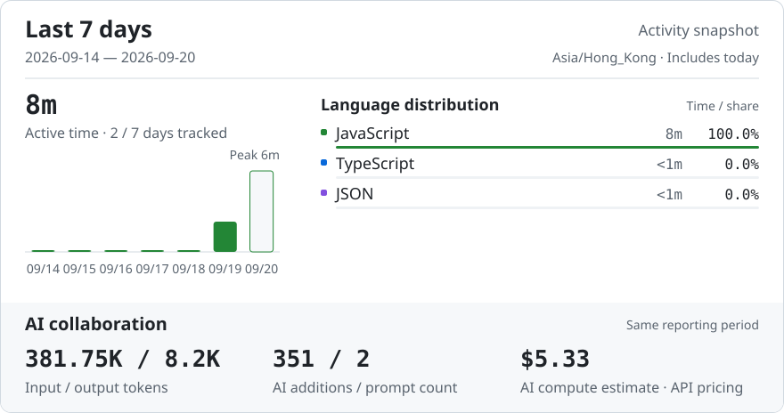
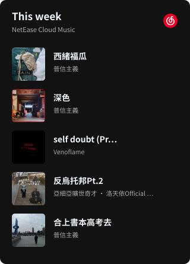

<h2 align="left">Finally, less can be more.</h2>

  <em>Me? Nobody.</em> 
  Building ideas with ChatGPT & Claude

  
  
  
  

~~~text
📊 Last 7 days

🕑 Time Zone: Asia/Hong Kong

2026-09-14 — 2026-09-20

💬 Programming Languages:
JavaScript                   8m  █████████████████████████ 100.0%
TypeScript                  <1m  ░░░░░░░░░░░░░░░░░░░░░░░░░   0.0%
JSON                        <1m  ░░░░░░░░░░░░░░░░░░░░░░░░░   0.0%

Activity time: 8m
~~~

 

  
<strong>Weekly Report</strong>

   

  

    <picture>
      <source media="(max-width: 600px) and (prefers-color-scheme: dark)" srcset="assets/report-dark-mobile-2049ffc163fa.svg">
      <source media="(max-width: 600px)" srcset="assets/report-light-mobile-867a4e6cf3ac.svg">
      <source media="(prefers-color-scheme: dark)" srcset="assets/report-dark-d89cd4faf0e7.svg">
      
    </picture>
  

 

  
<strong>Recent Activity</strong>

   

  <!-- ACTIVITY:START -->
<pre>🛠️  <strong>Updated project</strong> · <a href="https://github.com/LZSMIAO/2fa-hot">LZSMIAO/2fa-hot</a>                                  2026-09-19</pre>
<!-- ACTIVITY:END -->

 

<dl>
<dd>

<strong>Song links</strong>

<table align="center">
<thead><tr><th align="left">Track</th><th align="left">Artist</th></tr></thead>
<tbody>
<tr><td align="left" valign="top"><a href="https://music.163.com/song?id=3368186807">西緒福瓜</a></td><td align="left" valign="top">普信主義</td></tr>
<tr><td align="left" valign="top"><a href="https://music.163.com/song?id=3416118315">深色</a></td><td align="left" valign="top">普信主義</td></tr>
<tr><td align="left" valign="top"><a href="https://music.163.com/song?id=3434600677">self doubt (Prod.Robin Cause)</a></td><td align="left" valign="top">Venoflame</td></tr>
<tr><td align="left" valign="top"><a href="https://music.163.com/song?id=3330630999">反烏托邦Pt.2</a></td><td align="left" valign="top">亞細亞曠世奇才 · 洛天依Official · 烏托邦P</td></tr>
<tr><td align="left" valign="top"><a href="https://music.163.com/song?id=2724564061">合上書本高考去</a></td><td align="left" valign="top">普信主義</td></tr>
</tbody>
</table>

</dd>
</dl>

 

<strong>我為何放弃一切开始尝试 Vibe Coding</strong> Pt.1

 

　　…大概是 2021 年，第四次工業革命，人類進入 AI 時代。由此，我經常看到有人在濫用它，甚至專業程序員也幹這種勾當——只用五分鐘，就生成一個他媽的漸變、不對齊、用100個不同設計風格 UI、塞1000種元素的前端。只用 AI 隨便做個粗製濫造的垃圾系統，就能賣貨給灰產用戶發大財。…這一切看得我噁心，我從床上爬起來，吐了一遍又一遍，可惜未被它們穩穩接住。

　　我想要做的，有錢人都做過了。我做過的、在做的、未來想做的東西，也許別人早已玩膩。有時，一個念頭讓我整夜睡不著，後來才發現，它早有了名字、有了價格，甚至已停止維護。像走了很遠，終於找到一扇通往鄰居家的門。我站在那裡，連來意都顯得多餘。但是我走的時間實在過了太久，久到我都有點不確定自己究竟在做什麼。正如我和同事做的項目，我們為它們傾注太多。渴望早日上線，以換取經濟回報，可還是止不住一遍遍修訂，直到符合我們的要求，直到它被忘記。我也分不清，是還想把它做好，還是不捨得讓它就這樣做完。只記得那些凌晨，窗外已經沒什麼聲音了，我還會因為某個地方終於可行，而感到喜悅。這感覺像是回到六年前，打開 Premiere Pro，全身心投入創作，充滿動力，樂此不疲。但我仍害怕未來不會到來，如同歷史一樣，在某天就結束了。而如今我也再做不出影片了。令人感嘆。

　　我想要說的，前人們都說過了。我不反對 AI。六年前，我是文科生，我可能連他媽怎麼開個網站都不知道。而現在，我卻可以靠它，把原本只存在於腦子裡的東西一點點做出來。所以我希望，某些人能真正善用 AI。它能幫你做事，但不能成為你，永遠。別用它代替你的想法，代替你的判斷，最後甚至代替你的人生。因為當所有人都能用差不多的工具、差不多的模型、差不多的提示詞，把東西「做出來」之後，真正還能留下區別的，可能就只剩下你自己。

　　我想要的公平，都是不公們虛構的。我知道，我改變不了當今快節奏的生活，也攔不住那些東西。它們會繼續出現，繼續被製造，然後靠它賺到我可能幾個月都賺不到的錢。我以前總覺得，好的東西應該得到更多，粗製濫造的東西終究會被淘汰。但世界不公平，它不會因為多改一個像素、多熬了幾個晚上，就多獎勵你一些；也不會因為他隨手拼出一坨垃圾，就禁止他賺錢。我知道我改變不了這些，也攔不住它們。\
所以後來，我也踩上了那些造好的輪子上。

　　那麼 Vibe Coding，如果我也嘗試一下呢？當所有人踩上同樣的輪子，我的NFT，還能否有所不同？我相信，也希望，未來你們會喜歡上某些產品，雖然你不會知道它來自我——那個9年之前，十年之後將跌入互聯網的人。

 

  <picture>
    <source media="(prefers-color-scheme: dark)" srcset="https://raw.githubusercontent.com/LZSMIAO/LZSMIAO/output/github-contribution-grid-snake-dark.svg">
    <source media="(prefers-color-scheme: light)" srcset="https://raw.githubusercontent.com/LZSMIAO/LZSMIAO/output/github-contribution-grid-snake.svg">
    
  </picture>

