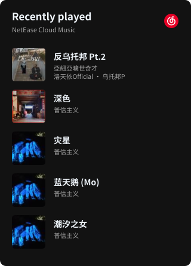

<h2 align="left">Finally, less can be more.</h2>

  <em>Me? Nobody.</em> 
  Building ideas ChatGPT & Laude

  
  
  
  

~~~text
📊 Last 7 days

🕑︎ Time Zone: Asia/Hong Kong

💬 Programming Languages:
Vue              19 hrs 52 mins   █████████████████░░░░░░░░  67.0%
Markdown          4 hrs 22 mins   ████░░░░░░░░░░░░░░░░░░░░  14.7%
TypeScript        2 hrs 24 mins   ██░░░░░░░░░░░░░░░░░░░░░░   8.1%
WGSL              1 hr 24 mins    █░░░░░░░░░░░░░░░░░░░░░░░   4.7%
Other             1 hr 37 mins    █░░░░░░░░░░░░░░░░░░░░░░░   5.5%

Activity time: 29h 39m
~~~

 

  
<strong>Weekly Report</strong>

   

  

    <picture>
      <source media="(max-width: 600px) and (prefers-color-scheme: dark)" srcset="assets/report-dark-mobile-2b1e5f3f75d1.svg">
      <source media="(max-width: 600px)" srcset="assets/report-light-mobile-7a6bd5c3798c.svg">
      <source media="(prefers-color-scheme: dark)" srcset="assets/report-dark-e3a0ab40ca00.svg">
      
    </picture>
  

 

  
<strong>Recent Activity</strong>

   

  <pre>🛠️  <strong>Updated project</strong> · <a href="https://github.com/LZSMIAO/2fa-hot">LZSMIAO/2fa-hot</a>                                      2026-09-09</pre>

 

Song links

<a href="https://music.163.com/song?id=3330630999"><strong>反乌托邦Pt.2</strong></a> <a href="https://music.163.com/artist?id=51497522">亞細亞曠世奇才</a> · <a href="https://music.163.com/artist?id=906118">洛天依Official</a> · <a href="https://music.163.com/artist?id=96237339">乌托邦P</a>

<a href="https://music.163.com/song?id=3416118315"><strong>深色</strong></a> <a href="https://music.163.com/artist?id=35654284">普信主义</a>

<a href="https://music.163.com/song?id=2664295379"><strong>灾星</strong></a> <a href="https://music.163.com/artist?id=35654284">普信主义</a>

<a href="https://music.163.com/song?id=2746375815"><strong>蓝天鹅 (Mo)</strong></a> <a href="https://music.163.com/artist?id=35654284">普信主义</a>

<a href="https://music.163.com/song?id=2652725695"><strong>潮汐之女</strong></a> <a href="https://music.163.com/artist?id=35654284">普信主义</a>

  <picture>
    <source media="(prefers-color-scheme: dark)" srcset="https://raw.githubusercontent.com/LZSMIAO/LZSMIAO/output/github-contribution-grid-snake-dark.svg">
    <source media="(prefers-color-scheme: light)" srcset="https://raw.githubusercontent.com/LZSMIAO/LZSMIAO/output/github-contribution-grid-snake.svg">
    
  </picture>

