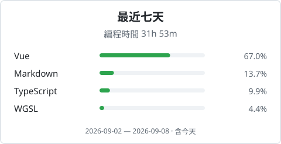
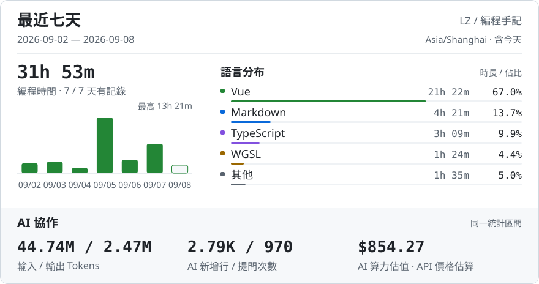

<h1 align="center">Hi, I'm LZ 👋</h1>

  會一點網路、一點伺服器，也在學著把前端寫好。 
  喜歡折騰小工具，讓有趣的想法變成能用的東西。

<picture>
  <source media="(prefers-color-scheme: dark)" srcset="assets/coding-dark-ce24c4e138ce.svg">
  
</picture>

編程週報

<picture>
  <source media="(max-width: 600px) and (prefers-color-scheme: dark)" srcset="assets/report-dark-mobile-7c540b83190b.svg">
  <source media="(max-width: 600px)" srcset="assets/report-light-mobile-b34ff4794fb5.svg">
  <source media="(prefers-color-scheme: dark)" srcset="assets/report-dark-d1deb23ae5b6.svg">
  
</picture>

最近動態

<!-- ACTIVITY:START -->
暫無可展示的公開動態，之後會自動更新。
<!-- ACTIVITY:END -->

<picture>
  <source media="(prefers-color-scheme: dark)" srcset="https://raw.githubusercontent.com/LZSMIAO/LZSMIAO/output/github-snake-css-dark.svg">
  <source media="(prefers-color-scheme: light)" srcset="https://raw.githubusercontent.com/LZSMIAO/LZSMIAO/output/github-snake-css.svg">
  
</picture>

