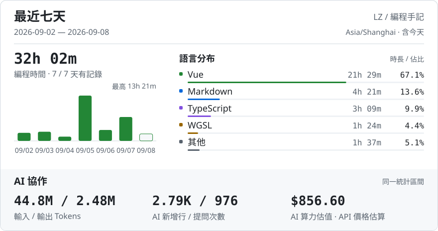

<h1 align="center">Hi, Its lzsm 👋</h1>

  Me? Nobody 
  Thanks to ChatGPT & Claude, made my ideas possible. 

 

<picture>
  <source media="(max-width: 600px) and (prefers-color-scheme: dark)" srcset="assets/coding-dark-mobile-999aefe1a1aa.svg">
  <source media="(max-width: 600px)" srcset="assets/coding-light-mobile-9c1de40d4cb3.svg">
  <source media="(prefers-color-scheme: dark)" srcset="assets/coding-dark-535c9c9dc7eb.svg">
  
</picture>

 

週報

<picture>
  <source media="(max-width: 600px) and (prefers-color-scheme: dark)" srcset="assets/report-dark-mobile-c9924797abeb.svg">
  <source media="(max-width: 600px)" srcset="assets/report-light-mobile-a3d233c1a242.svg">
  <source media="(prefers-color-scheme: dark)" srcset="assets/report-dark-fe7674dc1022.svg">
  
</picture>

最近動態

<!-- ACTIVITY:START -->
Null
<!-- ACTIVITY:END -->

<picture>
  <source media="(prefers-color-scheme: dark)" srcset="https://raw.githubusercontent.com/LZSMIAO/LZSMIAO/output/github-contribution-grid-snake-dark.svg">
  <source media="(prefers-color-scheme: light)" srcset="https://raw.githubusercontent.com/LZSMIAO/LZSMIAO/output/github-contribution-grid-snake.svg">
  
</picture>

